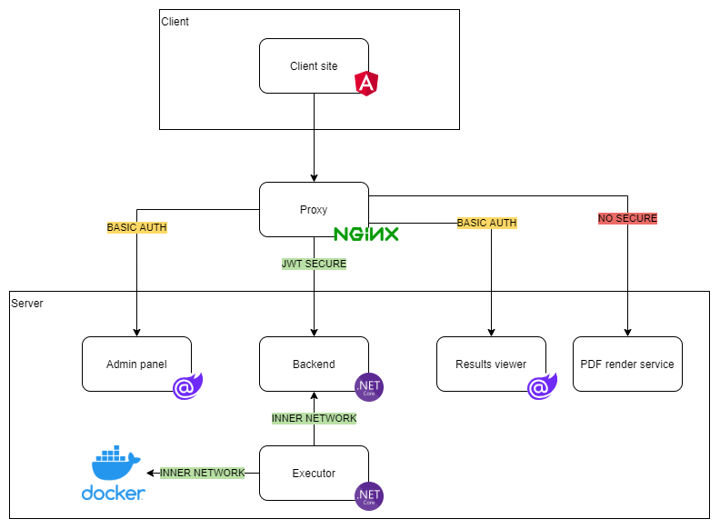
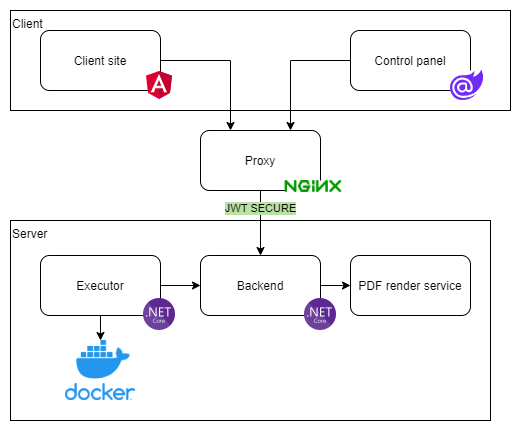

# Olympiad


## Current architecture

Now system uses `Admin panel` for managing all items and `Results viewer` for viewing results. Those services are available via `basic auth`, and allow full access to one login/password pair.




## Work in progress architecture

In the new system `Admin panel` and `Results viewer` based on `Blazor server` will be replaced with `Control panel` based on `Blazor WASM`. Access to managing and viewing results will be based on users' account and JWT.




## Run from docker hub images

To work using `docker-compose` you should use alias `odc` (**o**lympiad-**d**ocker-**c**ompose)
```bash
# On Windows
. .\alias.ps1

# On Linux
. ./alias.sh
```
In the next steps, the alias will be used
#### Pull images
```bash
odc pull
```

#### Start containers
```bash
odc up -d
```
Services and default users
| Service       | Url                          | User               | Password            |
| ------------- | ---------------------------- | ------------------ | ------------------- |
| User frontend | http://localhost:5500        | admin@localhost.ru | VeryStrongPass1     |
| Admin panel   | http://localhost:5500/admin/ | admin              | VeryStrongPassword1 |

## Build

## Requirements

* [.Net Core 3.1](https://dotnet.microsoft.com/download)
* [Node.JS 12+](https://nodejs.org/en/)

Use Cake wrapper to build all parts

### Build all
```bash
./build.ps1
```

### Build docker images

```bash
odc build --no-cache
```

### Start docker containers

```bash
odc up -d
```

### Deploy to production
> Using PowerShell

Create file `environment.ps1` (already in `.gitignore`)
```powershell
$Env:JWT_SECRET_KEY="key for jwt"
$Env:OLYMPIAD_DOMAIN="target domain"
$Env:OLYMPIAD_PRIVATE_REGISTRY_ADDRESS="your private registry for executor domain"
$Env:OLYMPIAD_PRIVATE_REGISTRY_LOGIN="your private registry for executor login"
$Env:OLYMPIAD_PRIVATE_REGISTRY_PASSWORD="your private registry for executor password"
$Env:RABBITMQ_PASSWORD="password for internal communication in rabbitmq"
$Env:GENERATE_USER_EMAIL_DOMAIN="domain to generate user accounts, like localhost.ru"
$Env:POSTGRES_CONNECTION_STRING="Connection string for production database"
$Env:EXECUTOR_USER_LOGIN="executor account login"
$Env:EXECUTOR_USER_PASSWORD="executor account password. CHANGE PASSWORD AFTER AUTO CREATING!"
$Env:S3_SERVICE_URL="s3 service address like storage.yandexcloud.net"
$Env:S3_SERVICE_ACCESS_KEY_ID="s3 key id"
$Env:S3_SERVICE_SECRET_ACCESS_KEY="s3 key secret"
$Env:S3_SERVICE_FORCE_PATH_STYLE="true if local like zenko, false id provider accepts bucket as subdomain"
$Env:S3_SERVICE_BUCKET_NAME="s3 bucket name"
```

Invoke
```powershell
. .\alias.ps1 ;; . .\environment.ps1 ;; .\genStack.ps1
```

Use `stack.yml` file to publish service to `docker swarm`